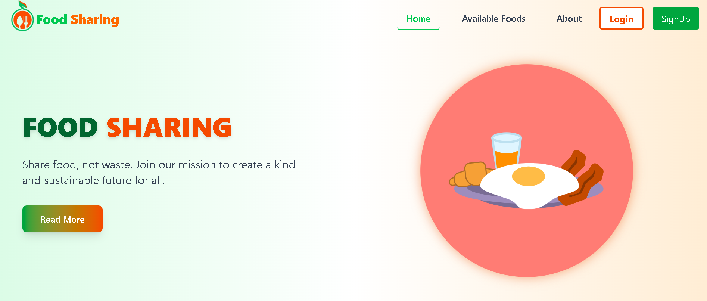

# 🍽️ Food Sharing Website

[Live Demo](https://food-sharing-1821c.web.app/)

---

## 📋 Project Overview
Food Sharing is a full-stack web application that helps reduce food waste by connecting donors with people in need. Donors can list surplus food items and recipients can request them. The app includes user roles, a dynamic dashboard, search & filter features, and a responsive UI.

---

## 📷 Screenshot
  


---

## 🛠️ Main Technologies Used
- **Frontend:** React, Vite, Tailwind CSS, React Router, Framer Motion  
- **State / Data:** Axios, @tanstack/react-query  
- **Forms & UI:** React Hook Form (optional), Lottie React, SweetAlert2  
- **Backend:** Node.js, Express.js, MongoDB (MongoDB Atlas)  
- **Auth & Payments:** Firebase Authentication, JWT, Stripe (test mode)  
- **Deployment:** Firebase Hosting (client), Vercel (server)

---

## 🚩 Core Features
- User registration & login (email/password + Google OAuth)  
- Role-based access: Admin, Donor, Receiver/Volunteer  
- Add / Edit / Delete food listings (with image, quantity, expiry, location)  
- Request food items and prevent duplicate requests for same item  
- Search/filter by district, upazila, blood group (or by location/category for food)  
- "Manage My Foods" and "My Requests" dashboards  
- Interactive UI with Lottie animations and Framer Motion transitions  
- Secure API endpoints with JWT and server-side validation  
- Stripe integration for donation payments (test mode)

---

## 📦 Key Dependencies
**Frontend**
- `react`, `react-dom`, `vite`
- `react-router-dom`
- `tailwindcss`
- `axios`
- `@tanstack/react-query`
- `framer-motion`
- `react-hook-form`
- `lottie-react`
- `sweetalert2`
- `firebase`

**Backend**
- `express`
- `mongoose`
- `cors`
- `dotenv`
- `jsonwebtoken`
- `stripe`
- `nodemon` (dev)

*(This list covers the main packages — check your `package.json` for full dependency lists.)*

---

## ⚙️ Run Locally (Client + Server)

> **Note:** This project may be structured as two folders: `/client` and `/server`. Follow the steps below accordingly.

1. **Clone repository**
```bash
git clone https://github.com/YOUR-GITHUB-USERNAME/food-sharing-app.git
cd food-sharing-app
